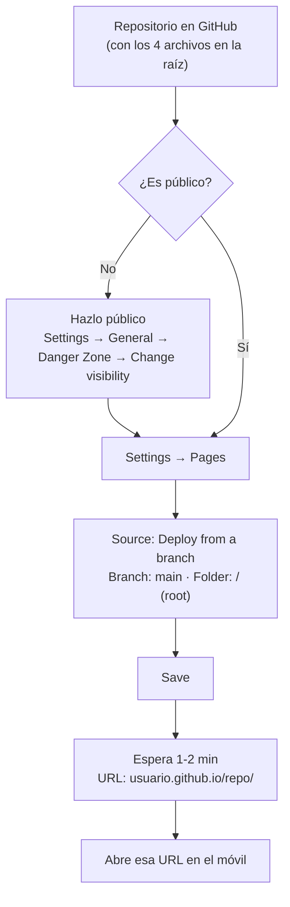
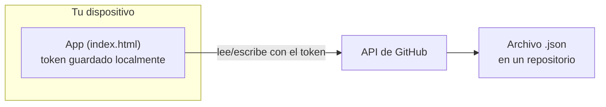

# ⚽ Cuentas F5·F7

App para gestionar el bote y las cuentas (créditos y deudas) de un grupo de
fútbol F5/F7 entre amigos: quién ha pagado de más, quién debe, cuánto hay en
el bote, generación de equipos equilibrados, y exportación de resúmenes como
imagen para compartir en el grupo de WhatsApp.

Funciona como **PWA (Progressive Web App)**: se instala desde el navegador,
sin pasar por Play Store ni necesitar permisos especiales en el móvil, y
puede **sincronizar los datos automáticamente con GitHub** para que estén
disponibles desde cualquier dispositivo.

## Índice

- [¿Qué hace la app?](#qué-hace-la-app)
- [Contenido del repositorio](#contenido-del-repositorio)
- [Instalación como app (PWA)](#instalación-como-app-pwa)
- [Sincronización de datos con GitHub](#sincronización-de-datos-con-github)
- [Guía de uso](#guía-de-uso)
- [Modelo de datos](#modelo-de-datos)
- [Preguntas frecuentes / problemas comunes](#preguntas-frecuentes--problemas-comunes)

---

## ¿Qué hace la app?

<details open>
<summary><strong>Ver descripción</strong></summary>

- Lleva la cuenta de **quién ha pagado de más (crédito)** y **quién debe
  (deuda)** en el grupo, separado por tipo de partido (**F5** y **F7**).
- Lleva un **bote común** (ingresos y gastos generales: balón, pista, etc.),
  independiente del saldo de cada jugador.
- Genera **equipos equilibrados** por nivel a partir de los jugadores que
  vayan a jugar ese día, con opción de intercambiar jugadores entre equipos.
- **Exporta una imagen** del resumen (bote, créditos, deudas) lista para
  compartir por WhatsApp, con las deudas destacadas primero.
- **Se instala como app** en el móvil (Android/iOS) sin pasar por ninguna
  tienda de aplicaciones.
- Puede **sincronizarse automáticamente con un repositorio de GitHub**, para
  que los datos estén disponibles desde varios dispositivos.

</details>

## Contenido del repositorio

<details open>
<summary><strong>Ver archivos</strong></summary>

| Archivo | Para qué sirve |
|---|---|
| `index.html` | La app en sí: toda la interfaz y la lógica (jugadores, movimientos, equipos, exportar imagen, sincronización con GitHub). Es el único archivo que hay que actualizar cuando se hacen mejoras. |
| `manifest.json` | Le dice al navegador el nombre de la app, su icono y que se abra a pantalla completa al instalarla. |
| `sw.js` | Service worker: permite que la app funcione sin conexión y que las actualizaciones se vean al abrirla. |
| `icon.svg` | Icono que se muestra en la pantalla de inicio una vez instalada. |
| `*.json` (por ejemplo `futbol-cuentas-backup.json`) | Archivo de datos: jugadores y movimientos. Es el archivo con el que se sincroniza la app (ver más abajo). No es código, son los datos reales del grupo. |

> Los 4 primeros archivos (`index.html`, `manifest.json`, `sw.js`, `icon.svg`)
> tienen que estar siempre **sueltos en la raíz del repositorio**, no dentro
> de una subcarpeta, y con esos nombres exactos.

</details>

## Instalación como app (PWA)

<details>
<summary><strong>Ver pasos completos</strong></summary>

Un PWA no es un `.apk`: es una página web que el propio navegador deja
"instalar" como si fuera una app normal. Para que esto funcione, la app tiene
que servirse por **HTTPS** — no vale abrir el `index.html` descargado
directamente desde el móvil.

### Opción A — GitHub Pages



1. Sube los 4 archivos de la app a un repositorio de GitHub.
2. **Importante:** con cuenta gratuita, GitHub Pages **solo funciona en
   repositorios públicos**. Si el tuyo es privado, Pages no se activa y
   te dará error 404 al intentar abrir la web — hazlo público desde
   **Settings → General → Danger Zone → Change repository visibility**.
3. Ve a **Settings → Pages**.
4. En **Source**, elige **Deploy from a branch**, rama `main`, carpeta
   `/ (root)`, y pulsa **Save**.
5. Espera 1-2 minutos. GitHub te da una URL tipo
   `https://TU-USUARIO.github.io/TU-REPO/`.

### Opción B — Netlify Drop (si prefieres no hacer público el repo de código)

1. Entra en [app.netlify.com/drop](https://app.netlify.com/drop) (sin
   cuenta).
2. Arrastra los 4 archivos (`index.html`, `manifest.json`, `sw.js`,
   `icon.svg`).
3. Te da al momento una URL `https://algo-random.netlify.app` funcionando.

### Instalar en el móvil

1. Abre la URL (de GitHub Pages o Netlify) en Chrome, Edge o Samsung
   Internet.
2. Toca el menú **⋮** → **"Instalar app"** o **"Añadir a pantalla de
   inicio"** (a veces aparece directamente como aviso, sin tener que abrir
   el menú).
3. Aparece un icono nuevo en la pantalla de inicio. Ábrelo desde ahí (no
   desde el navegador) para que se vea a pantalla completa.

</details>

## Sincronización de datos con GitHub

<details>
<summary><strong>Ver configuración completa</strong></summary>

La app puede leer y escribir automáticamente un archivo `.json` en un
repositorio de GitHub cada vez que se añade o edita algo, para que los datos
estén disponibles desde cualquier dispositivo (móvil, ordenador, etc.).



### 1. Crea un token de acceso personal (solo para ese repositorio)

1. En GitHub: icono de tu perfil (arriba a la derecha) → **Settings** →
   **Developer settings** → **Personal access tokens** → **Fine-grained
   tokens** → **Generate new token**.
2. En **Repository access**, elige **Only select repositories** y marca
   únicamente el repositorio donde quieras guardar los datos.
3. En **Permissions → Repository permissions**, busca **Contents** y ponlo
   en **Read and write**. No hace falta ningún otro permiso.
4. Genera el token y cópialo (solo se muestra una vez).

### 2. Configúralo en la app

1. Abre la app → **Ajustes → Sincronización con GitHub**.
2. Rellena:
   - **Usuario u organización**: tu usuario de GitHub.
   - **Repositorio**: el nombre del repo donde está (o quieres que esté)
     el archivo de datos.
   - **Archivo dentro del repo**: por ejemplo `futbol-cuentas-backup.json`.
   - **Rama**: normalmente `main`.
   - **Token**: el que has generado.
3. Pulsa **Guardar y sincronizar**. Si el archivo ya existe en el repo, lo
   descarga y carga los datos. Si no existe, lo crea con lo que haya en ese
   momento en el dispositivo.
4. A partir de ahí, cada movimiento que registres se sube solo a los
   pocos segundos, y al abrir la app en otro dispositivo con la misma
   configuración se descarga automáticamente lo último.

### 🔒 Mantener los datos privados (recomendado)

> El repositorio donde está el **código de la app** (`index.html`, etc.)
> tiene que ser público para poder usar GitHub Pages gratis — pero **el
> archivo de datos no tiene por qué estar en ese mismo repositorio**.

Puedes usar dos repositorios distintos:

- Uno **público**, solo con los 4 archivos de la app (no contiene ningún
  dato real de jugadores).
- Otro **privado**, que contenga únicamente el `.json` de datos, y que se
  configure como destino de la sincronización en **Ajustes**.

Así, el código sigue siendo accesible para que GitHub Pages funcione, pero
los nombres y saldos del grupo solo los puede leer quien tenga el token, ya
que un repositorio privado no es accesible ni por la web ni por la API de
GitHub sin autenticación.

> ⚠️ El token se guarda en el navegador de cada dispositivo donde lo
> configures, y solo se usa para hablar directamente con la API de GitHub.
> Puedes revocarlo en cualquier momento desde GitHub (Developer settings →
> Tokens → Delete) y desconectarlo desde **Ajustes → Desconectar** en la
> app. Si dos personas guardan cambios casi a la vez desde dos dispositivos,
> gana el último en guardarse — no hay fusión automática de datos.

</details>

## Guía de uso

<details>
<summary><strong>Resumen</strong></summary>

Pantalla principal. Arriba, un selector **F5 / F7** cambia todo lo que se ve
por debajo a ese tipo de partido:

- **Marcador** con tres cifras: **Bote** (dinero común), **Jugadores** (suma
  de todos los saldos de jugadores) y **Balance** (la suma de ambos).
- **Exportar imagen**: genera una imagen lista para compartir, con las
  deudas destacadas primero.
- Tres listas: **Con crédito** (a favor), **Al día** (saldo cero) y **Con
  deuda**. Tocar un jugador abre un atajo para registrarle un movimiento
  rápido.

</details>

<details>
<summary><strong>Jugadores</strong></summary>

Listado completo de jugadores, con buscador y filtros (F5 / F7 / habituales).
Tocar un jugador abre su ficha para editarlo o eliminarlo. El botón **+**
añade uno nuevo, con estos campos:

- **Nombre**
- **Tipo**: F5, F7, o ambos (F5/F7)
- **Nivel**: bajo / medio / alto / muy alto — se usa para el generador de
  equipos equilibrados
- **Posición**: portero / defensa / medio / delantero (opcional)
- **Habitual o esporádico**

</details>

<details>
<summary><strong>Movimientos</strong></summary>

Para registrar cargos o abonos. Tiene dos pestañas:

- **A jugadores**: eliges tipo de partido, uno o varios jugadores (por
  ejemplo, todos los que jugaron un partido), si el importe **suma** (abona)
  o **resta** (carga), la cantidad y un motivo opcional. El importe se
  aplica igual a cada jugador seleccionado.
- **Al bote**: igual, pero para el dinero común (ingresos o gastos), no
  ligado a un jugador concreto.

</details>

<details>
<summary><strong>Equipos</strong></summary>

Para repartir equipos el día del partido:

1. Elige tipo de partido (F5/F7).
2. Marca qué jugadores están presentes ese día.
3. Pulsa **Equilibrar** (reparte según el nivel de cada uno) o **Aleatorio**.
4. Toca dos jugadores (uno de cada equipo) para intercambiarlos manualmente.
5. **Compartir equipos** copia el reparto como texto para pegarlo en
   WhatsApp.

</details>

<details>
<summary><strong>Ajustes</strong></summary>

- **Sincronización con GitHub**: ver sección específica más arriba.
- **Copia de seguridad manual**: exportar o importar un `.json` con todos
  los datos, sin pasar por GitHub.
- **Historial**: todos los movimientos (de jugadores y del bote), con
  buscador y filtro por tipo de partido.
- **Borrar todos los datos**: reinicia la app por completo (con
  confirmación).

</details>

## Modelo de datos

<details>
<summary><strong>Ver estructura del archivo .json</strong></summary>

```json
{
  "players": [
    { "id": "...", "name": "...", "type": "F7", "isRegular": true, "skill": "medio", "position": "" }
  ],
  "transactions": [
    { "id": "...", "playerIds": ["..."], "amount": -8, "matchType": "F7", "reason": "pista", "createdAt": "..." }
  ],
  "generalTransactions": [
    { "id": "...", "amount": 30, "matchType": "F7", "reason": "balón", "createdAt": "..." }
  ],
  "footballs": [],
  "exportDate": "...",
  "version": "2.0"
}
```

- Un jugador con `type: "F5/F7"` participa en ambos tipos de partido; su
  saldo se calcula por separado según el `matchType` de cada movimiento.
- Un movimiento con varios `playerIds` aplica el mismo `amount` a cada uno
  (por ejemplo, el coste de la pista repartido entre los asistentes).

</details>

## Preguntas frecuentes / problemas comunes

<details>
<summary><strong>Me da 404 al abrir la URL de GitHub Pages</strong></summary>

- Comprueba que el repositorio es **público** (con cuenta gratuita, Pages no
  funciona en repos privados).
- Comprueba que los 4 archivos están **en la raíz** del repo, no dentro de
  una subcarpeta.
- En **Settings → Pages** debe aparecer "Your site is live at..." con una
  marca verde. Si no, espera un par de minutos o repite el paso de elegir
  rama `main` + `/(root)` y guardar.

</details>

<details>
<summary><strong>Error "Token inválido o sin permisos"</strong></summary>

- El permiso **Contents** del token tiene que estar en **Read and write**,
  no en "Read-only".
- En "Repository access" del token, comprueba que está seleccionado el
  repositorio correcto.
- Comprueba que el token no ha caducado (Settings → Developer settings →
  Personal access tokens).
- Vuelve a pegarlo entero en **Ajustes** — a veces se corta al copiarlo.

</details>

<details>
<summary><strong>No veo los cambios después de actualizar index.html en GitHub</strong></summary>

El `sw.js` incluido usa una estrategia "primero red": si hay conexión, coge
siempre la versión más reciente al abrir la app. Si aun así no se actualiza,
cierra del todo la app instalada y vuelve a abrirla.

</details>
